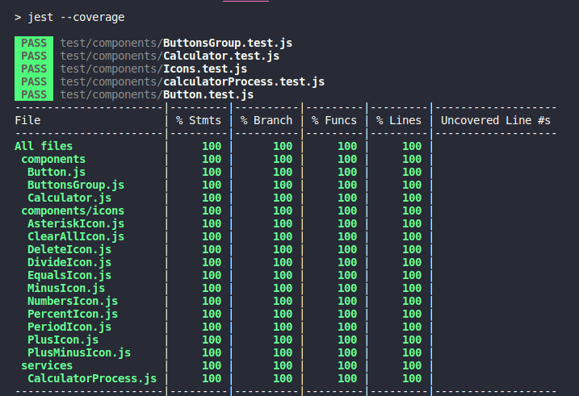

# My Calculator project

My Calculator_Project it's the way i'm using to learn new skills and improve them.

### Getting Started

Make sure you're using the latest LTS node.js version!

### Installing

Install all the dependencies:

```
    npm install
```
Let's get started by running webpack on terminal to generate your `/dist` folder:

```
    npm run build
```
After that, to see your page on browser you have to run:

```
    npm run server
```
Then, if you want to automatically save your changes you need to run and after this it'll open in your browser a localHost:

```
    npm run watch
```

### You just successfully generated your page!

At this point one more thing you should run in your terminal, are the tests. Follow the next steps to run Jest.

## Runnig test with Jest
You can run the tests with `npm run test` command line, it will run `jest --coverage` and generate a `/coverage` folder and it'll show this in your terminal:



Now, since we have our page builded and tests passed we just need to run Eslint in our code to maintain a pattern.
Run `npm run lint:fix` command line, it'll trigger eslint only on `src/.` , but this can be changed on `.eslintrc.js` configuration.
it will return all the code that have to be fixed if needed and fix the errors.